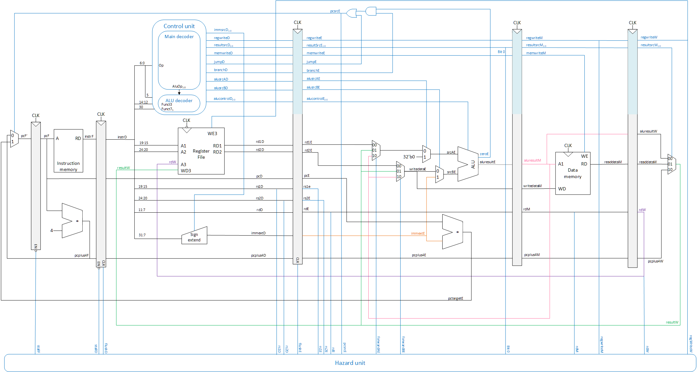
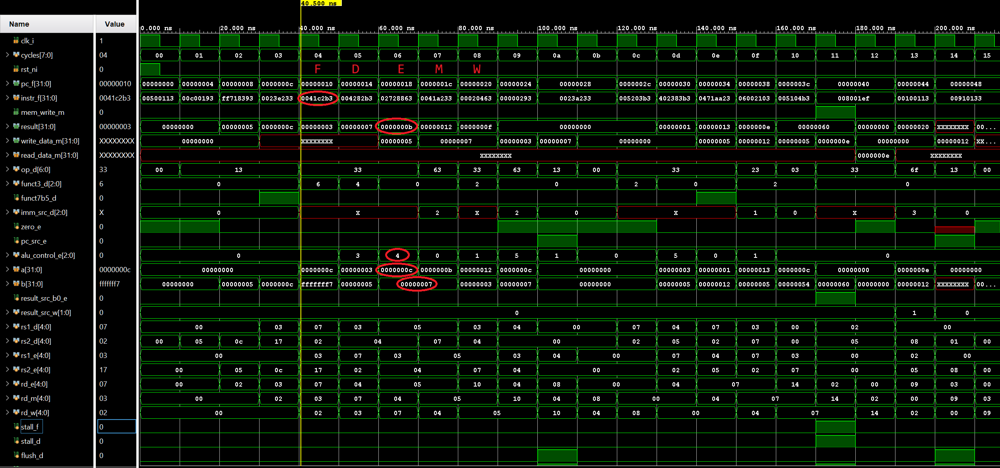
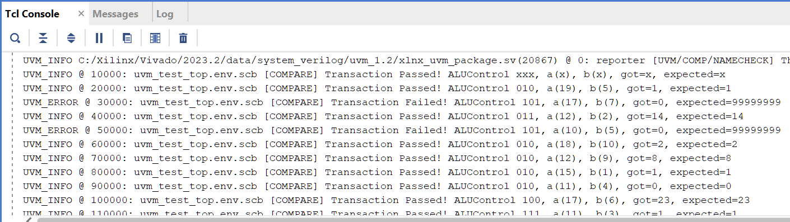

# RISC-V pipelined processor
- A RISC-V core written in SystemVerilog
- Supports a dozen RV32IM instructions
- Built in Xilinx Vivado 2023 with simulation 
- UVM based testbench
- Device tested: Artix-7 35T
- Fmax: 105 MHz (with WNS of 0.5 ns)
- LUTs: 775
- FFs: 543

Complete RISC-V processor handling all hazards

Waveform 
E.g. fetch instruction (0041C2B3) and do XOR (AluOp 4) in Execute stage, resulting in 0x7 ^ 0xC = 0xB

UVM based testbench (agent, monitor, scoreboard, etc) verifying ALU behaviour

